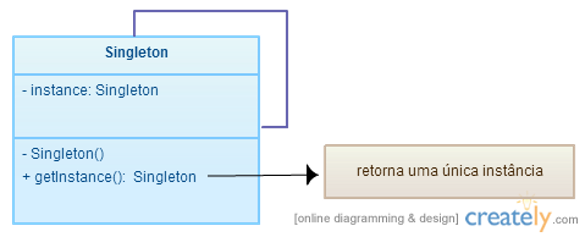

# Padrão Singleton

##Objetivo
Garantir que uma classe só tenha uma única instância e criar um ponto de acesso global a essa instância
### Diagrama de Classe de UML 


## Receita para tornar uma classe Singleton:
 * Define-se a classe como final.
 * O método construtor passará a ser privado.
 * Define-se uma variável de classe (static) que usualmente denominamos de instance do tipo da classe. 
 * Define-se o método getInstance que retorna essa instancia e a instancia se ela for null.

```java
public final class Singleton {

    private static Singleton instance;
    // others attributes
    private int attribute;

    private Singleton(){
        attribute=0;
    }

    //get instance
    public static Singleton getInstance() {
        if(instance== null) instance= new Singleton();
        return instance;
    }

    //other methods

    public int getAttribute() {
        return attribute;
    }

    public void setAttribute(int attribute) {
        this.attribute = attribute;
    }
}

```

### Usar um Singleton

```java

        Singleton.getInstance().setAttribute(50);
        System.out.println(Singleton.getInstance().getAttribute());

```

## Exercício

Pretende-se criar um Logger, de forma a registar num ficheiro as ações relativas a um jogo, indicando o instante que as ações forma realizzadas:
* inicio do jogo
* adição de um novo jogador
* jogada efetuada

 1 - Modifique a classe logger de forma a torna-la um Singleton
   
 2 - Altere a classe Gammer e Game de forma a registar no ficheiro de logger as ações acima identificadas
    
 3 - Execute o main, sem o modificar o ficheiro de logger deve ter o seguinte aspeto:

```
Thu Dec 03 21:11:53 GMT 2020  new Gammer - ana
Thu Dec 03 21:11:53 GMT 2020  game start
Thu Dec 03 21:11:53 GMT 2020  play 3
Thu Dec 03 21:11:53 GMT 2020  play 5
Thu Dec 03 21:11:53 GMT 2020  new Gammer - pedro
Thu Dec 03 21:11:53 GMT 2020  game start
```


